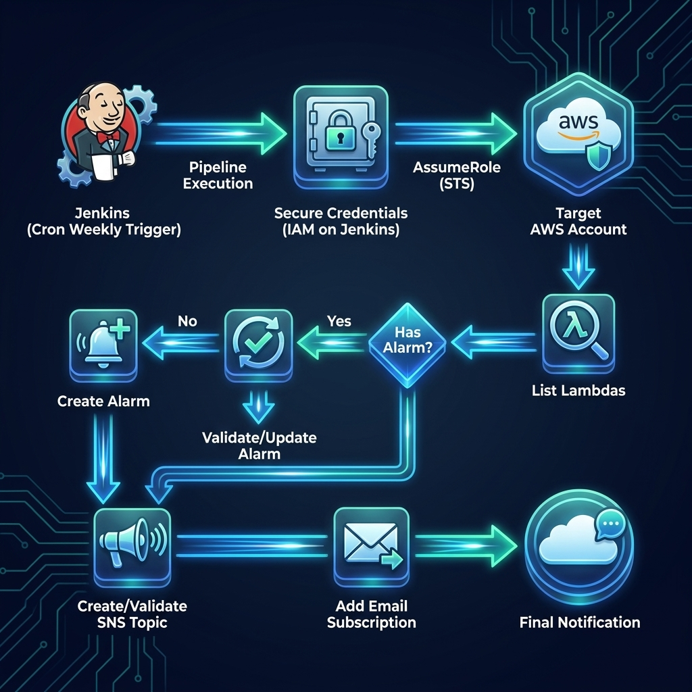

# Jenkins Pipeline - Alarmas CloudWatch para errores en AWS Lambda





Este repositorio contiene un `Jenkinsfile` simple para revisar funciones AWS Lambda en dos cuentas AWS y asegurar que cada función tenga una alarma de CloudWatch asociada a la métrica `Errors`.

La idea de esta versión es mantener el uso lo más directo posible:

- El usuario copia el `Jenkinsfile`.
- Crea un pipeline nuevo en Jenkins.
- Cambia las variables de configuración.
- Ejecuta el pipeline.

No requiere scripts externos, archivos JSON ni estructura adicional de carpetas.

---

## ¿Qué hace el pipeline?

Por cada cuenta AWS configurada, el pipeline realiza lo siguiente:

1. Usa una credencial AWS guardada de forma segura en Jenkins Credentials.
2. Usa esa credencial base para ejecutar `sts:AssumeRole` hacia la cuenta destino.
3. Asume el rol IAM configurado en la cuenta AWS destino.
4. Crea o reutiliza un SNS Topic para las alarmas de errores Lambda.
5. Agrega una suscripción por correo al SNS Topic si no existe.
6. Lista todas las funciones Lambda de la cuenta.
7. Crea o actualiza una alarma CloudWatch para la métrica `AWS/Lambda Errors`.
8. Publica una notificación opcional indicando que el proceso terminó para esa cuenta.

---

## Flujo general

```text
Jenkins Credential
Access Key / Secret Key
        ↓
Usuario IAM AWS origen
        ↓
sts:AssumeRole
        ↓
Rol IAM en cuenta destino
        ↓
Lambda + CloudWatch + SNS
```


---

## Modelo de acceso entre cuentas con `sts:AssumeRole`

Este pipeline no necesita guardar credenciales de todas las cuentas AWS en Jenkins.

La idea recomendada es usar **una sola credencial AWS en Jenkins**, asociada a un usuario IAM de una cuenta origen. Ese usuario IAM no administra directamente todas las cuentas, sino que tiene permiso para ejecutar `sts:AssumeRole` sobre roles creados en las cuentas destino.

Ejemplo conceptual:

```text
Cuenta B / cuenta origen
└── Usuario IAM: jenkins-lambda-monitoring
    └── Access Key ID + Secret Access Key guardadas en Jenkins Credentials
        └── Permiso: sts:AssumeRole hacia roles de otras cuentas

Cuenta A / cuenta destino
└── Rol IAM: lambda-alarmas-sns
    ├── Confía en el usuario IAM de la cuenta origen
    └── Tiene permisos sobre Lambda, CloudWatch y SNS
```

Con este modelo, Jenkins se autentica inicialmente usando el usuario IAM guardado en Jenkins Credentials. Luego el pipeline ejecuta:

```bash
aws sts assume-role   --role-arn "arn:aws:iam::<ACCOUNT_ID_DESTINO>:role/lambda-alarmas-sns"   --role-session-name "SessionName-xxxxxxx"
```

AWS responde con credenciales temporales para el rol de la cuenta destino. Desde ese momento, el pipeline puede listar Lambdas, crear SNS Topics y crear o actualizar alarmas CloudWatch dentro de esa cuenta destino.

Esto permite que, por ejemplo, un usuario IAM ubicado en una cuenta central o compartida pueda operar sobre una o más cuentas AWS destino, siempre que:

1. El usuario IAM origen tenga una política que permita `sts:AssumeRole` hacia los roles destino.
2. Cada rol destino tenga una trust policy que permita ser asumido por el usuario IAM origen.
3. Cada rol destino tenga los permisos necesarios para trabajar con Lambda, CloudWatch y SNS.

Por ejemplo, con una sola credencial Jenkins se puede recorrer más de una cuenta:

```text
Jenkins Credentials
└── Usuario IAM origen
    ├── assume-role hacia Cuenta A / rol lambda-alarmas-sns
    └── assume-role hacia Cuenta B / rol lambda-alarmas-sns
```

En este caso, Jenkins no necesita una Access Key por cada cuenta. Solo necesita una Access Key de origen bien protegida y permisos de `AssumeRole` correctamente configurados.

---

## Requisitos en Jenkins

El agente Jenkins donde se ejecuta el pipeline debe tener instalado:

- AWS CLI
- jq
- Plugin de Jenkins compatible con credenciales AWS, por ejemplo:
  - AWS Credentials Plugin
  - Credentials Binding Plugin

Puedes validarlo desde el servidor o agente Jenkins con:

```bash
aws --version
jq --version
```

---

## Credencial AWS en Jenkins

Debes crear una credencial AWS en Jenkins con un **Access Key ID** y un **Secret Access Key**.

Ruta típica:

```text
Manage Jenkins > Credentials > System > Global credentials > Add Credentials
```

Tipo sugerido:

```text
AWS Credentials
```

Ejemplo de ID de credencial:

```text
jenkins
```

Ese valor debe coincidir con la variable del `Jenkinsfile`:

```groovy
defaults['AWS_CREDENTIALS'] = 'jenkins'
```

Si tu credencial en Jenkins se llama de otra forma, por ejemplo:

```text
aws-prod-monitoring
```

entonces debes configurar:

```groovy
defaults['AWS_CREDENTIALS'] = 'aws-prod-monitoring'
```

Importante: el valor usado en el Jenkinsfile corresponde al **ID de la credencial en Jenkins**, no al Access Key ID de AWS.

---

## Permiso requerido para la credencial AWS de Jenkins

La credencial guardada en Jenkins representa un usuario IAM o rol AWS de origen.

Ese usuario IAM debe tener permiso para asumir el rol en cada cuenta destino.

Ejemplo de política para el usuario IAM asociado a la Access Key guardada en Jenkins:

```json
{
  "Version": "2012-10-17",
  "Statement": [
    {
      "Effect": "Allow",
      "Action": "sts:AssumeRole",
      "Resource": [
        "arn:aws:iam::111111111111:role/lambda-alarmas-sns",
        "arn:aws:iam::222222222222:role/lambda-alarmas-sns"
      ]
    }
  ]
}
```

Si usas más cuentas, debes agregar cada ARN de rol destino en `Resource`.

---

## Rol IAM requerido en cada cuenta destino

En cada cuenta AWS que será revisada debe existir un rol IAM con el nombre configurado en el Jenkinsfile.

Ejemplo:

```groovy
defaults['AWS_ROLE_NAME'] = 'lambda-alarmas-sns'
```

El pipeline construye el ARN automáticamente usando el ID de cada cuenta:

```text
arn:aws:iam::<ACCOUNT_ID>:role/lambda-alarmas-sns
```

Ejemplo:

```text
arn:aws:iam::111111111111:role/lambda-alarmas-sns
```

---

## Trust policy del rol en la cuenta destino

El rol de cada cuenta destino debe confiar en el usuario IAM asociado a la credencial de Jenkins.

Ejemplo:

```json
{
  "Version": "2012-10-17",
  "Statement": [
    {
      "Effect": "Allow",
      "Principal": {
        "AWS": "arn:aws:iam::<SOURCE_ACCOUNT_ID>:user/<JENKINS_IAM_USER>"
      },
      "Action": "sts:AssumeRole"
    }
  ]
}
```

Ejemplo más concreto:

```json
{
  "Version": "2012-10-17",
  "Statement": [
    {
      "Effect": "Allow",
      "Principal": {
        "AWS": "arn:aws:iam::999999999999:user/jenkins-lambda-monitoring"
      },
      "Action": "sts:AssumeRole"
    }
  ]
}
```

---

## Política mínima sugerida para el rol destino

El rol asumido en cada cuenta destino necesita permisos para listar Lambdas, revisar alarmas, crear o actualizar alarmas y administrar el SNS Topic usado por las alarmas.

```json
{
  "Version": "2012-10-17",
  "Statement": [
    {
      "Effect": "Allow",
      "Action": [
        "lambda:ListFunctions",
        "cloudwatch:DescribeAlarms",
        "cloudwatch:PutMetricAlarm",
        "sns:CreateTopic",
        "sns:SetTopicAttributes",
        "sns:Subscribe",
        "sns:ListTopics",
        "sns:ListSubscriptionsByTopic"
      ],
      "Resource": "*"
    }
  ]
}
```

---

## Permiso para notificación central de proceso

El pipeline puede publicar un mensaje al terminar cada cuenta usando esta variable:

```groovy
defaults['PROCESS_NOTIFICATION_TOPIC_ARN'] = 'arn:aws:sns:us-east-1:TU_ACCOUNT_ID:Notificacion-Proceso-Actualizacion-Alarmas'
```

Si usas esta opción, la credencial base de Jenkins debe tener permiso para publicar en ese topic:

```json
{
  "Version": "2012-10-17",
  "Statement": [
    {
      "Effect": "Allow",
      "Action": "sns:Publish",
      "Resource": "arn:aws:sns:us-east-1:TU_ACCOUNT_ID:Notificacion-Proceso-Actualizacion-Alarmas"
    }
  ]
}
```

Si no quieres usar notificación central de proceso, deja el valor vacío:

```groovy
defaults['PROCESS_NOTIFICATION_TOPIC_ARN'] = ''
```

---

## Configuración del Jenkinsfile

Edita solamente la sección superior del `Jenkinsfile`.

Ejemplo:

```groovy
def defaults = [:]

defaults['AWS_CREDENTIALS'] = 'jenkins'
defaults['AWS_REGION'] = 'us-east-1'
defaults['AWS_ROLE_NAME'] = 'lambda-alarmas-sns'
defaults['NOTIFICATION_EMAIL'] = 'lambda.notificaciones@tudominio.cl'
defaults['PROCESS_NOTIFICATION_TOPIC_ARN'] = 'arn:aws:sns:us-east-1:TU_ACCOUNT_ID:Notificacion-Proceso-Actualizacion-Alarmas'
```

Luego cambia los valores de cada cuenta dentro de su stage correspondiente:

```bash
account_id="111111111111"
account_name="Cuenta-A"
```

Y para la segunda cuenta:

```bash
account_id="222222222222"
account_name="Cuenta-B"
```

---

## Variables principales

| Variable | Descripción | Ejemplo |
|---|---|---|
| `AWS_CREDENTIALS` | ID de la credencial AWS guardada en Jenkins | `jenkins` |
| `AWS_REGION` | Región donde se revisarán Lambdas y se crearán alarmas/SNS | `us-east-1` |
| `AWS_ROLE_NAME` | Nombre del rol a asumir en cada cuenta destino | `lambda-alarmas-sns` |
| `NOTIFICATION_EMAIL` | Correo que recibirá las notificaciones del SNS de alarmas | `lambda.notificaciones@tudominio.cl` |
| `PROCESS_NOTIFICATION_TOPIC_ARN` | SNS Topic opcional para notificar fin de proceso | `arn:aws:sns:us-east-1:111111111111:topic` |
| `account_id` | ID de cuenta AWS destino | `111111111111` |
| `account_name` | Nombre lógico de la cuenta usado en logs y nombres de SNS | `Cuenta-A` |

---

## Cómo ejecutar en Jenkins

### Opción 1: Pipeline script

1. Crear un nuevo item en Jenkins.
2. Seleccionar `Pipeline`.
3. Ir a la sección `Pipeline`.
4. En `Definition`, seleccionar `Pipeline script`.
5. Pegar el contenido completo del `Jenkinsfile`.
6. Cambiar las variables de configuración.
7. Guardar.
8. Ejecutar con `Build Now`.

### Opción 2: Pipeline desde GitHub

1. Subir el `Jenkinsfile` al repositorio.
2. Crear un pipeline en Jenkins.
3. Seleccionar `Pipeline script from SCM`.
4. Configurar el repositorio GitHub.
5. Ejecutar.

---

## Cómo agregar más cuentas

Para agregar una tercera cuenta, copia el bloque de stage de una cuenta existente y cambia:

```bash
account_id="333333333333"
account_name="Cuenta-C"
```

También copia o adapta el stage de notificación si quieres mantener una notificación por cuenta.

---

## Seguridad

No subas al repositorio:

- Access Keys.
- Secret Access Keys.
- Session Tokens.
- IDs reales de cuentas, si tu organización los considera sensibles.
- ARNs internos reales, si tu organización los considera sensibles.
- Correos internos reales.

El repositorio público debería usar placeholders como:

```groovy
defaults['AWS_CREDENTIALS'] = 'TU_CREDENTIAL_ID_DE_JENKINS'
defaults['NOTIFICATION_EMAIL'] = 'lambda.notificaciones@tudominio.cl'
defaults['PROCESS_NOTIFICATION_TOPIC_ARN'] = 'arn:aws:sns:us-east-1:TU_ACCOUNT_ID:TU_TOPIC_NAME'
```

Y en los stages:

```bash
account_id="TU_ACCOUNT_ID"
account_name="TU_ACCOUNT_NAME"
```

Las Access Keys deben quedar únicamente en Jenkins Credentials.

---

## Troubleshooting

### `Could not find credentials entry with ID`

El valor de `defaults['AWS_CREDENTIALS']` no coincide con el ID de la credencial guardada en Jenkins.

Revisa en:

```text
Manage Jenkins > Credentials
```

Debes usar el valor de la columna `ID`.

---

### `AccessDenied: User is not authorized to perform sts:AssumeRole`

Puede deberse a una de estas causas:

1. El usuario IAM asociado a la credencial de Jenkins no tiene permiso `sts:AssumeRole`.
2. El ARN del rol destino no está incluido en la política del usuario IAM origen.
3. El trust policy del rol destino no confía en el usuario IAM origen.
4. El nombre del rol configurado en `AWS_ROLE_NAME` no coincide con el rol real en AWS.

---

### `An error occurred (InvalidClientTokenId)`

La Access Key o Secret Key guardada en Jenkins puede estar incorrecta, desactivada o eliminada.

---

### `aws-cli no está instalado`

Instala AWS CLI en el agente Jenkins.

---

### `jq no está instalado`

Instala `jq` en el agente Jenkins.

En Ubuntu/Debian:

```bash
sudo apt-get update
sudo apt-get install -y jq
```

---

### No llegan correos SNS

AWS SNS envía un correo de confirmación al endpoint configurado.

El destinatario debe confirmar la suscripción antes de recibir notificaciones de alarmas.

---

## Recomendación para publicar el repositorio

Antes de subir el proyecto a GitHub, deja el `Jenkinsfile` con valores genéricos:

```groovy
defaults['AWS_CREDENTIALS'] = 'TU_CREDENTIAL_ID_DE_JENKINS'
defaults['AWS_REGION'] = 'us-east-1'
defaults['AWS_ROLE_NAME'] = 'lambda-alarmas-sns'
defaults['NOTIFICATION_EMAIL'] = 'lambda.notificaciones@tudominio.cl'
defaults['PROCESS_NOTIFICATION_TOPIC_ARN'] = 'arn:aws:sns:us-east-1:TU_ACCOUNT_ID:TU_TOPIC_NAME'
```

Y reemplaza las cuentas por ejemplos:

```bash
account_id="111111111111"
account_name="Cuenta-A"
```

```bash
account_id="222222222222"
account_name="Cuenta-B"
```

